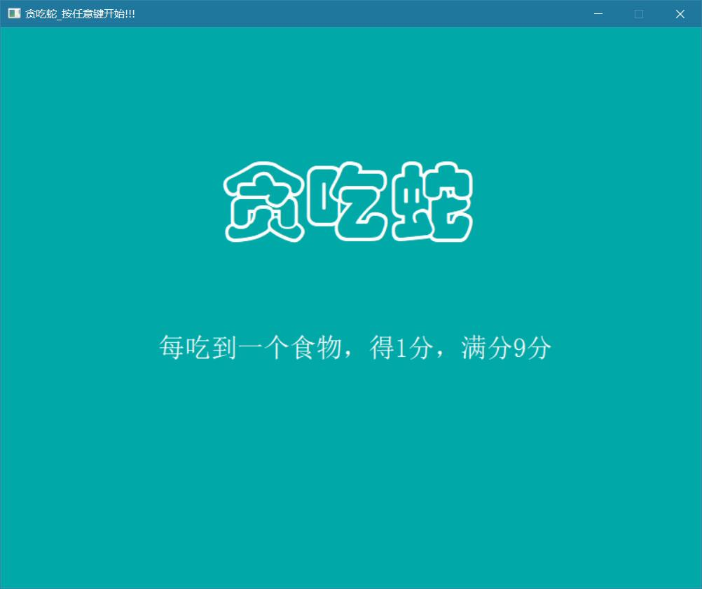
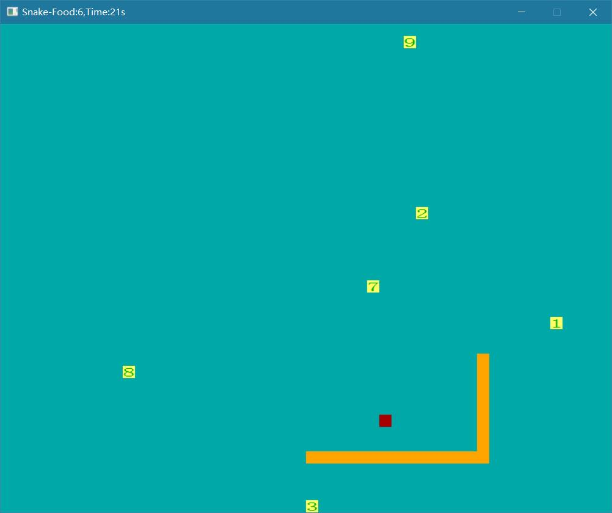
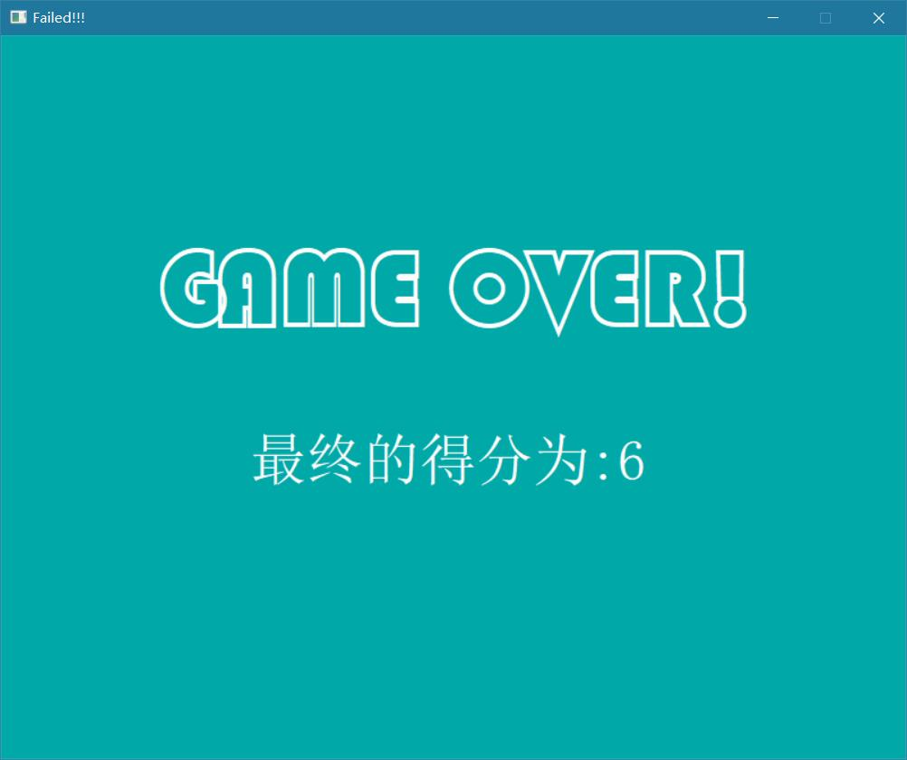
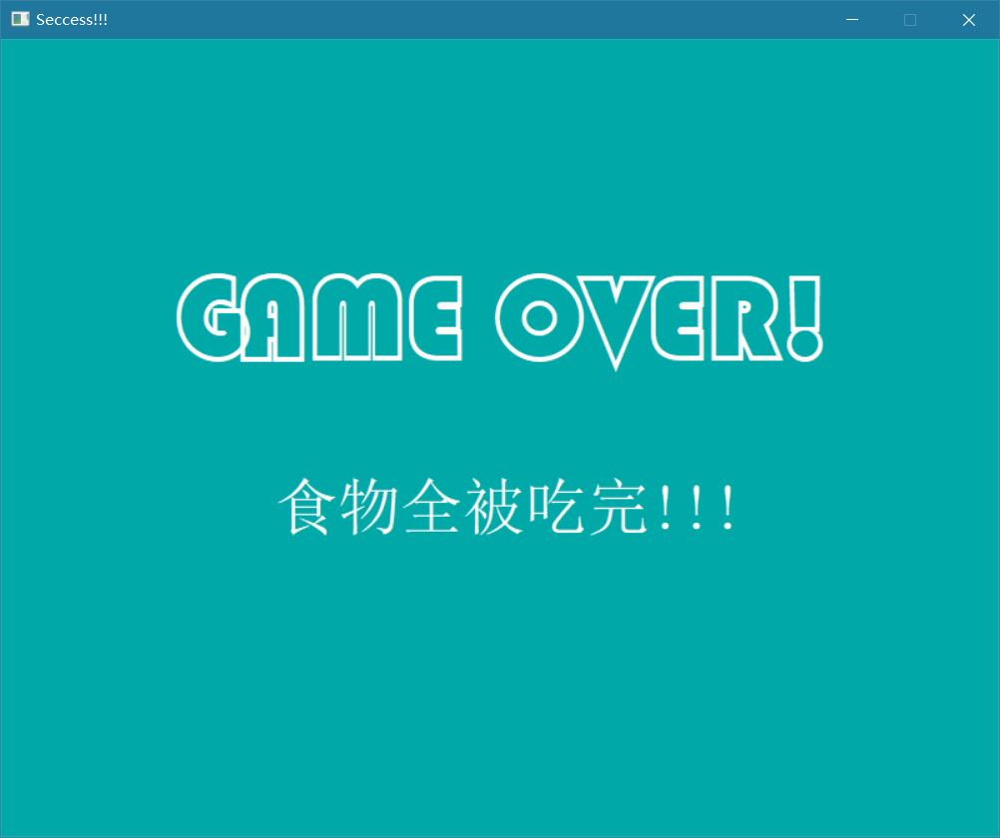

# 贪吃蛇

程序运行环境：VS2019

> 2019-2020春季学期大作业 

### 编程思路：

1. 本贪吃蛇游戏用的`ege`库。
2. 在游戏里有三个物体：蛇、食物、怪兽，蛇用结构体来表示，怪兽用的类来表示它的坐标，食物用的两个数组来表示它的坐标。
3. 用`begin();over();init_Snake(); init_food_monster(); playGame();` 这几个主要的函数来表示游戏过程。
4. 用 `set_monster_coordinate()、set_food_coordinate()`来生成怪兽和食物的坐标。
5. 用`int Hitwall_and_Hitself_HeadEatByMonster()`判断蛇是否撞墙、蛇头是否与其他蛇身重合、被怪物吃。
6. 用`draw_snake()；draw_monster()`来画移动过程中的蛇和怪物。
7. 用随机数的大小范围控制蛇和怪兽的移动速度。

### 已实现功能：

1. 蛇初始为一个橙黄色方块，表示蛇头，当蛇移动时长大，蛇身与蛇头颜色一致，蛇的初始长度为5个方块。
2. 可以用上下左右方向键控制蛇的移动时，当蛇把所有的食物吃完并将身体长大游戏者将赢得游戏。
3. 当蛇头碰到墙壁蛇停止移动，移动停止后表示失败。
4. 蛇头允许穿过蛇的身体，并且当蛇吃到食物并长大的时候蛇的移动速度变慢。
5. 食物在游戏中显示为1-9个数字和浅黄色方块的组合，位置随机摆放，当蛇头与数字重合时表示吃到食物，蛇身将按吃到的数字长大，在长大的时间里，蛇头移动时尾巴不动，直到蛇的长度完全长到蛇的实际长度为止。
6. 怪兽为一个红色的方块，怪兽的速度比蛇慢，它与蛇头重合时表示抓住了蛇，游戏失败并结束。
7. 标题显示游戏时间和剩余的食物数。

### 存在的一些缺点：

1. 当蛇尾通过蛇身时会将通过的那一个变成背景色，但当蛇完全过去后就恢复正常了。
2. 如果蛇尾和怪兽相遇，蛇和怪兽离去后会在相遇方块处留下蛇身颜色的方块，待蛇再次经过后，即恢复正常。

### 运行效果

---

end……
